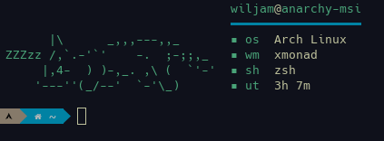

# catfetch

It's another system info fetching tool but this one prints ascii art of a cat instead of distro logo ascii art.  
NOTE: I didn't make the ascii art of cat i found it on the internet.

### screenshot

NOTE: the colorscheme is [spaceduck](https://github.com/pineapplegiant/spaceduck)

### why

I made this as an exercise to practice bash scripting.
